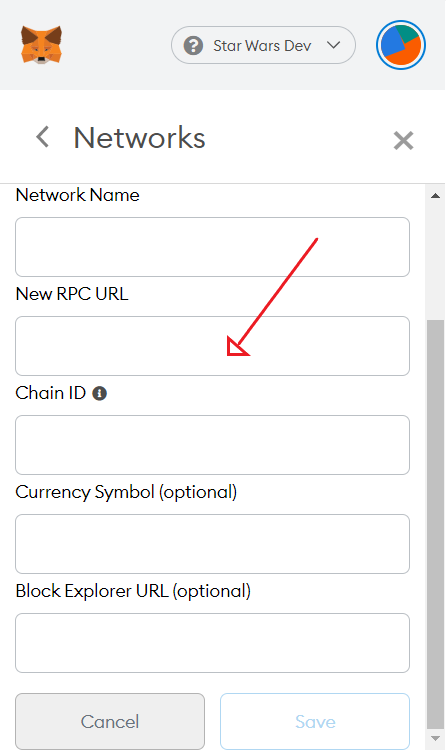
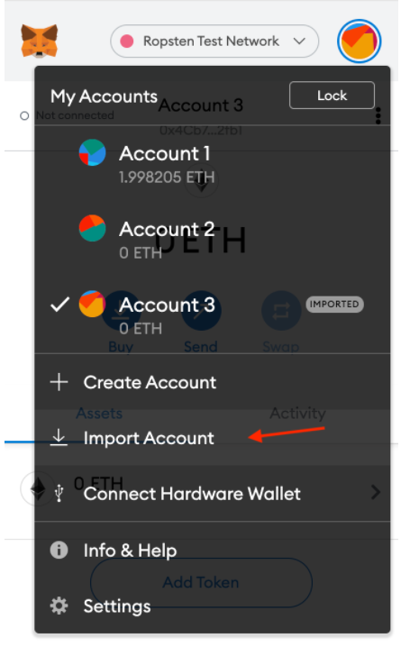
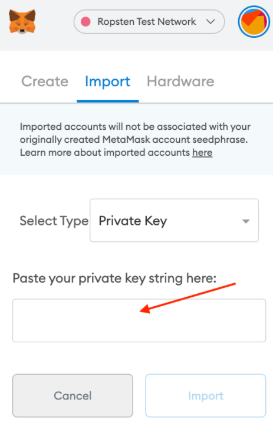
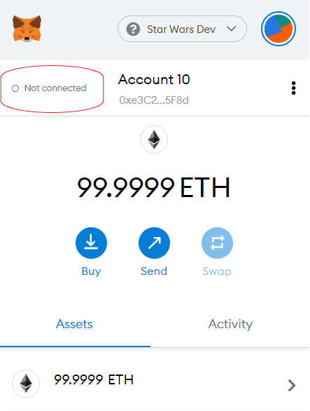

# Star Wars Voting DApp

Vote for your favourite Star Wars Characters. This was a project I choose because I wanted to try some blockchain/smart contract development and gain a greater understanding of the Ethereum blockchain.

## **Download MetaMask**

While in chrome download the MetaMask browser extension from *https://metamask.io/*

MetaMask is a software cryptocurrency wallet used to interact with the Ethereum blockchain.

## **Setup the project with Truffle**

To use on your computer you must download Truffle Suite. Truffle provides a range of tools that allow for testing and development of decentralized applications

**Download Truffle**

```bash
npm install -g truffle
```

**Deploying Contracts**

Contracts must be deployed to the blockchain

In the root directory run:

```bash
truffle develop
```

While in the truffle development console run: 

```bash
deploy
```

### **Run Server**

While using a different terminal, from the root directory run:

```bash
cd client

npm install
```

Run the server

```bash
npm start
```

## Testing

To run tests from the root directory run:

```bash
npm install
truffle test
```

## **An Example of Creating a Test Network**

To use the Dapp, you will need to create a local network or use a predefined one with the URL of 

*http://127.0.0.1:8545*

In MetaMask creating a new network is as easy as clicking on the list of networks and then clicking on *Custom RPC.* From here you will be able to give your network a name and address *(Your address must be the same as the one specified in the Dapp. For this project the local address is [http://127.0.0.1:8545](http://127.0.0.1:8545))*. Save the network.



Make sure to switch to your test network when using the Dapp

A detailed example can be found at: 

https://metamask.zendesk.com/hc/en-us/articles/360043227612-How-to-add-a-custom-Network-RPC-and-or-Block-Explorer

## **An Example of Importing accounts from Truffle into MetaMask**

To use the Dapp you will need to have test accounts that have Ethereum in them. When Truffle initialize accounts, Ethereum is added for development purposes. This Ethereum can not be used on the main network, it is purely for development purposes.  

Firstly you will need a private key from one of the accounts that was initialed when you ran the `truffle develop` command. This can be found from within your console (It is the first text that is displayed after running the `truffle develop` command)

 


On startup 10 Test accounts are created, Copy a private key ready to paste into MetaMask.

In MetaMask Select *Import Account*



Past your private key in and press import



You can connect to the website by clicking the *connect button*, this will connect you to the react application when you have it in your current browsing window.



A detailed example can be found at: 

https://metamask.zendesk.com/hc/en-us/articles/360015489331-How-to-import-an-Account

To add more accounts, you simply just follow the steps above for importing accounts. You do not need to create a new network every time you import a new account. Importing multiply accounts will come in handy as it means that you can simulate an election.
